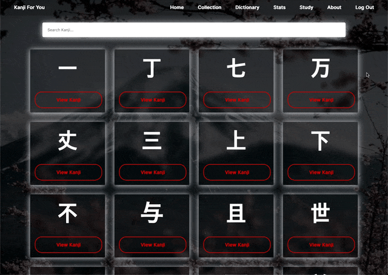
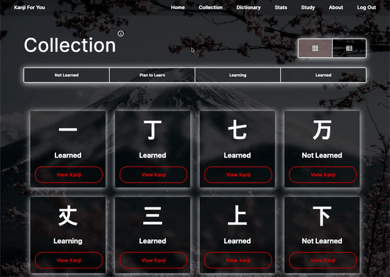
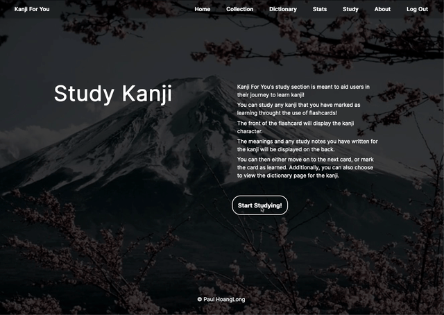

# Kanji For You:

## Description

_Duration: 2 Weeks_

Over the course of two weeks, the goal was to create a functional full-stack web based application. The web based application allow users to keep track of the Japanese kanji they are learning, while also serving as a study tool through the use of a dictionary and flashcards.

[Kanji For You Link](https://fast-ravine-45961-1010336a3328.herokuapp.com/#/welcome)

## Screen Shots
GIF showing kanji dictionary:

GIF showing kanji collection:

GIF showing kanji study:

## Description & Approach

By creating a scope document for the project, I was able to envision how I wanted the website to operate and flow. By using wireframes and describing what each page does, I was able to create a comfortable user flow.

[Project Scope Document](https://docs.google.com/document/d/1YPZ7CIhF5DNpO2swNuclWy-ghg3_uxmmLOaLcuUFgYk/edit?usp=sharing)

### Prerequisites
- [Node.js](https://nodejs.org/en/)
- [React.js](https://react.dev/)
- [Redux.js](https://redux.js.org)
- [Redux-Saga.js](https://redux-saga.js.org/)
- [Express.js](https://expressjs.com/)
- [Passport.js](https://www.passportjs.org/)
- [Chart.js](https://www.chartjs.org/)
- Body-Parser
- 'PG'
- Database Manager

## Installation
1. Clone this repository for your own access.
2. Open up your editor of choice and run `npm install`
3. Using your preferred database manager. Use the provided SQL file to set up the database as well as insert dummy data if needed.
4. Run `npm run server`  and `npm run client` in two different terminals.
5. Navigate to http://localhost3000/

## Usage
This web application is meant to allow users to keep track of the Japanese kanji they are learning, while also serving as a study tool through the use of a dictionary and flashcards.:
 1. The user can search up kanji on the dictionary page.
 2. Users can view more details about the kanji and see information such as meanings, readings, and example words.
 3. Users can add/edit/delete any study notes they would like to have on that specific kanji.
 4. Users can view their collection and filter by learning status. Additionally, users can change the learning status from the collection page
 5. By navigating to the stats page, users can view data on how much kanji they know or are learning.
 6. By navigating to the study page, users can test their knowledge on kanji they have marked as learning. Notecards of the kanji are randomly shown.

## Acknowledgement
Thanks to [Prime Digital Academy](www.primeacademy.io) who equipped and helped me to make this application a reality.

## Support
If you have suggestions or issues, please email me at [paulhoanglong@gmail.com](www.google.com)